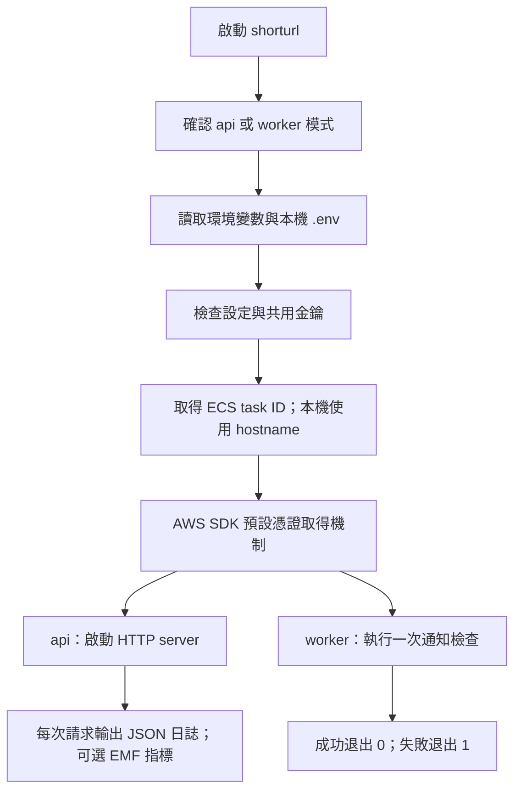

# ECS 準備：程式調整與驗收

本階段完成應用程式的容器化準備。AWS 資源、自動擴縮政策、EventBridge Scheduler 與 Grafana 尚未部署。

## 1. 啟動與設定流程



`go run .` 和 `go run . api` 都啟動 API；`go run . worker` 執行一次通知工作。API 裡面不再啟動 cron。未知指令會直接失敗，不會誤啟動服務。

`.env` 只用於本機開發。既有環境變數優先，不會被 `.env` 覆蓋；ECS 可直接注入環境變數與 Secrets Manager 的金鑰。設定載入完成後保持不變。

| 變數 | 預設／說明 |
|---|---|
| `PORT` | `8080` |
| `AWS_REGION` | `ap-northeast-1` |
| `PUBLIC_BASE_URL` | `https://brief-url.link`；不包含 `/url_api` |
| `GOOGLE_REDIRECT_URL` | `http://localhost:9001`；正式部署要改成前端回呼網址，並在 Google OAuth 設定相同 URI |
| `SHORTURL_TABLE_NAME` | `shorturl_service` |
| `USER_TABLE_NAME` | `user_data` |
| `ITINERARY_TABLE_NAME` | `daily_itinerary` |
| `SUBSCRIPTION_TABLE_NAME` | `subscription` |
| `SHUTDOWN_TIMEOUT` | `20s`，停止時等待進行中請求的期限 |
| `WORKER_TIMEOUT` | `5m`，單次 Worker 的最長執行時間 |
| `HTTP_TIMEOUT` | `15s`，AWS、Google、Web Push 的單次 HTTP 呼叫期限；AWS SDK 重試可能使整個操作較長 |
| `SERVICE_NAME` | `shorturl`，指標與日誌中的服務名稱 |
| `METRICS_NAMESPACE` | `ShortURL/API` |
| `ENABLE_EMF_METRICS` | `false`；部署到 CloudWatch Logs 後可設 `true` |
| `GCP_CLIENT_SECRET_ID`／`GCP_CLIENT_SECRET_KEY` | 兩者都設定才啟用 Google 登入；都留空則相關端點回傳 503 |
| `JWT_SECRET`、`VAPID_PUBLIC_KEY`、`VAPID_PRIVATE_KEY` | 必填；沿用既有值，所有 API 副本與 Worker 共用 |

資料表名稱可變，但既有資料表結構與索引名稱沒有改變。`User-Date-index`、`Account-Date-index`、`Date-Time-index` 仍須存在。

不要用範例檔覆蓋既有 `.env`，也不要為這次改造輪替 JWT／VAPID 金鑰。JWT 輪替會讓現有登入失效，VAPID 輪替可能讓既有推播訂閱失效。`.env.*` 會被 Git 忽略，只有不含真實金鑰的 `.env.example` 保留在版本控制中。

## 2. AWS 驗證流程

已移除應用程式強制指定固定 Access Key 的做法。程式沿用目前 SDK 的預設憑證取得機制與共享設定支援：

1. 本機開發可提供環境變數或 AWS profile；暫時憑證需包含 `AWS_SESSION_TOKEN`。
2. EC2 部署使用 instance role。
3. ECS 部署使用 task role，SDK 取得並更新暫時憑證。

在 EC2／ECS 上不要再注入本機 Access Key，因為環境變數憑證會優先於 role。task role 控制 API／Worker 的 DynamoDB 權限；task execution role 則用於 ECR 拉映像、傳送容器日誌和讀取注入的 secrets，兩者在 Terraform 階段分別建立。

一般主機上的 AWS profile 不會自動出現在 Docker 容器內。本機 Docker 驗收需提供開發環境的暫時憑證，或另行掛載適當的 AWS 設定與憑證；不要將金鑰打包到映像。

本次仍沿用既有 AWS SDK Go v1，未將全專案遷移至 v2；SDK 升級需另行處理與驗收。

## 3. API 與跨 task 登入流程

API 路徑與回應格式保留；建立短網址時使用 `PUBLIC_BASE_URL`。健康端點為 `/url_api/healthz`，僅檢查程序能否回應，不代表 DynamoDB 或外部服務一定可用。

一般登入產生的 JWT 用共用 `JWT_SECRET` 簽署，因此不同 API 副本可驗證同一個登入憑證。

Google 登入不再使用每個程序各自產生的固定 state：

1. `/url_api/google_login` 建立隨機 nonce，產生 10 分鐘有效、用 JWT 金鑰衍生出的獨立金鑰簽署的 state。
2. state 放在 Google 授權網址中，同時寫入 HttpOnly／SameSite=Lax Cookie；HTTPS 回呼設定會啟用 Secure。
3. 前端保留既有流程，把 Google 的 `state` 與 `code` 送到 `/url_api/google_call_back`；瀏覽器同時送出 Cookie。
4. 任何共用相同金鑰的 task 都能檢查簽章、期限及 Cookie 是否一致。
5. 驗證後刪除 Cookie，再向 Google 換取登入資訊與應用 JWT。

因此不需要為登入功能設定 ALB sticky session。前端和 API 需維持目前的同源入口；CloudFront 的 API behavior 必須關閉快取、轉送 Cookie／Authorization／query string，並保留 origin 的 Set-Cookie。登入前請求及登入回呼必須使用相同網站 hostname。並行開啟多次 Google 登入會更新同一個 state Cookie，應完成最新一次登入。

## 4. 通知 Worker 流程

Worker 查詢台北時區的未來 30 分鐘行程，讀取訂閱並發送 Web Push，執行完即結束：

1. 查詢 `Date-Time-index`，處理 DynamoDB 分頁。
2. 以分鐘精度使用半開的 30 分鐘區間，例如 10:00–10:29，避免與下一次 10:30 起的區間重疊。
3. 跨午夜時分別查詢兩個日期。
4. 同一輪工作中，每個帳號最多通知一次；沒有完整訂閱資料就跳過。
5. 個別通知或訂閱查詢失敗時繼續處理其他帳號，最後回報失敗，程序退出 1。
6. 收到停止訊號或達到 `WORKER_TIMEOUT` 時取消 AWS／推播請求。

這消除了 API 擴成兩個 task 所造成的重複排程。它不保證多個 Worker 並行執行或排程重試時只寄一次；如果未來開啟自動重試，需要另外設計持久化的通知去重機制。Scheduler 尚未建立，現在只啟動 API 不會自動寄送行程提醒。實際切換部署時，必須先接上獨立排程。

## 5. 日誌、指標與關機

API、Worker 的運行日誌寫入 stdout，採 JSON 格式。請求日誌包含 request ID、路由樣板、HTTP method、狀態碼、毫秒延遲與 task ID。`X-Request-ID` 可串接請求；不直接記錄請求本文、Authorization、Cookie 或 query string。`/url_api/:key` 使用路由樣板，不會以每個短碼建立指標維度。

啟用 EMF 後，同一筆請求日誌會包含 `Requests`、`Errors`（5xx）、`Latency` 指標，維度分為 `Service/Route/Method` 與 `Service/TaskId`。健康檢查保留日誌，但不納入業務請求指標。CloudWatch Logs 接收到這些日誌後才會擷取指標；不需要讓 API 額外呼叫 PutMetricData。task ID 維度與日誌量會影響監控成本，需在部署階段設定保留期限及展示期間的使用方式。

收到 SIGTERM 或 Ctrl+C 時，API 停止接受新連線，等待進行中請求完成，最多等待 `SHUTDOWN_TIMEOUT`。超時會關閉連線並以非零狀態退出。Compose 等待 30 秒，應用預設等待 20 秒；ECS 的 stopTimeout 也應大於應用期限，ALB draining 在部署階段配置。

映像已加入 CA 憑證，以支援 AWS、Google 與 Web Push 的 HTTPS 連線；Worker 取消繼承 API 的容器健康檢查。

## 6. 本機驗收

測試檔暫時移除，後續再補。現在先確認程式能建置，並通過靜態檢查；這兩項不會連到正式 AWS：

```bash
go vet ./...
go build ./...
```

Docker 可用且已準備開發環境 `.env` 時：

```bash
docker compose --profile replicas up -d --build api api2
curl -f http://localhost:8080/url_api/healthz
curl -f http://localhost:8081/url_api/healthz
docker compose logs --tail=20 api api2
```

| 驗收 | 預期 |
|---|---|
| API 1 登入取得 token，API 2 呼叫需登入的端點 | 可用 |
| API 1 建立短網址，API 2 解析短碼 | 可用，設定與資料共享 |
| 同時執行 API 1 與 API 2 | 不會啟動通知排程 |
| Google 登入與回呼落在不同副本 | 共用 state 簽章與 Cookie 可驗證 |
| 停止 API | 正常結束，日誌出現 shutdown 事件 |

Worker 以下指令會真的查詢 `.env` 指定的資料表並可能寄通知，應使用測試資料表和測試訂閱：

```bash
docker compose --profile worker run --rm --no-deps worker
```

停止本機容器：

```bash
docker compose --profile replicas down
```

沒有 Docker 時可開兩個終端，以相同 `.env` 分別執行：

```bash
PORT=8080 go run . api
```

```bash
PORT=8081 go run . api
```

按 Ctrl+C 觸發正常關機。這些 API 會使用你提供的真實 AWS 憑證與資料表，功能驗收請指向測試資料表；健康檢查本身不讀写 DynamoDB。

## 7. 下一階段

沿用既有 VPC 與 EC2，補上跨兩個 AZ 的私有子網路、內部 ALB、ECS 的出網方式、ECR、task roles 和 secrets 注入。先部署一個 API task，再接 CloudFront VPC origin／WAF，最後接獨立 Worker 排程、CloudWatch／Grafana、自動擴縮和 EC2 壓測。

此應用仍需對外連線完成 Google 登入和 Web Push，私有子網路的出網設計要涵蓋這些外部服務；只有 AWS VPC endpoints 無法取代這部分需求。
